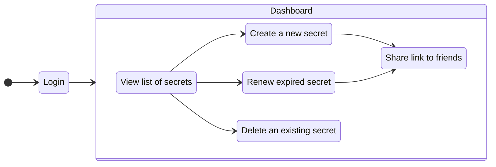
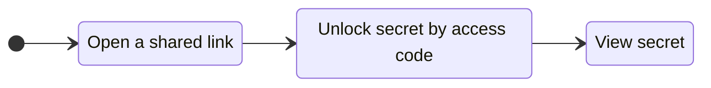

# What is Secretium?

This section will help you understand what **Secretium** is.

<!--@include: ./parts/block_want-to-try.md-->

**Secretium** is a free and open source software that helps to securely share sensitive data between users. It is great for situations where transferring your data in the open may be compromised or simply unsafe.

## Supported data formats

At this stage of product development, the following data formats are supported:

- **Text** (any length).

## On the administrator's side

As an administrator, you can log in to the admin dashboard, see a **list** of all your secrets, **add**/**renew** or **delete** a secret.

This is shown more clearly in the diagram below:

### Expiring secrets

Each secret created must have an **expiration date**.

The available period for the expiration date ranges from 5 minutes to 30 days. This is designed to increase security.

### Secret that will expire after the first unlocking

You can create a secret that will **automatically expire** after the first unlock.

Even if the expiration date you set has not yet passed, the secret will be set to "expired" and will no longer be viewable by your friends.

## On the user's side

As a user, you can **unlock** your friend's secret by entering the **access code**.

::: info Where is the access code?
The code for access must be provided by your friend. It may contain random letters and numbers, which you will have to enter into a special field on the shared page. Only **after** that, the secret will be **unlocked** and you'll see the contents.
:::

This is shown more clearly in the diagram below:

<!--@include: ./parts/links.md-->